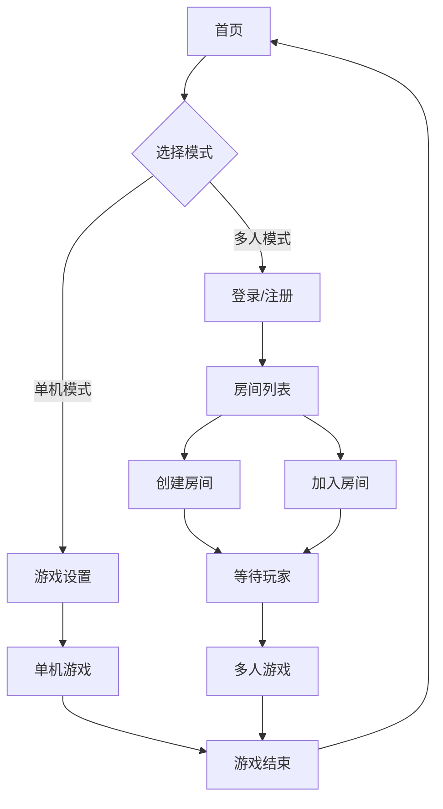

## 1. 产品概述
德州扑克模拟训练器是一款基于Web的扑克游戏训练平台，旨在帮助玩家提升德州扑克技巧。产品提供单机训练模式和多人对战模式，支持AI策略模拟和概率计算，让玩家在安全环境中练习和掌握扑克技巧。

目标用户：德州扑克爱好者、扑克初学者、想要提升牌技的玩家。产品通过AI对战和概率分析帮助用户理解游戏规则、掌握策略技巧。

## 2. 核心功能

### 2.1 用户角色
| 角色 | 注册方式 | 核心权限 |
|------|----------|----------|
| 单机用户 | 无需注册 | 使用单机模式，自定义游戏参数，与AI对战 |
| 在线用户 | 邮箱注册 | 创建/加入房间，与其他玩家对战，查看游戏历史 |

### 2.2 功能模块
德州扑克模拟训练器包含以下主要页面：
1. **首页**：模式选择、游戏设置、导航菜单
2. **单机游戏页**：牌桌界面、玩家信息、概率显示、操作控制
3. **多人游戏页**：房间列表、创建房间、加入房间
4. **设置页**：AI策略选择、游戏参数配置

### 2.3 页面详情
| 页面名称 | 模块名称 | 功能描述 |
|----------|----------|----------|
| 首页 | 模式选择 | 选择单机模式或多人模式，显示两种模式的简要说明 |
| 首页 | 快速开始 | 使用默认设置快速开始单机游戏 |
| 单机游戏页 | 牌桌区域 | 显示公共牌、玩家手牌、筹码堆、底池金额 |
| 单机游戏页 | 玩家信息 | 显示每个玩家的用户名、筹码数量、当前状态 |
| 单机游戏页 | 概率计算器 | 实时显示当前手牌获胜概率、可能牌型概率 |
| 单机游戏页 | 操作面板 | 提供弃牌、跟注、加注、全押等操作按钮 |
| 单机游戏页 | 游戏日志 | 显示每轮操作记录、AI决策逻辑 |
| 多人游戏页 | 房间列表 | 显示可加入的房间、在线玩家数量 |
| 多人游戏页 | 创建房间 | 设置房间参数（玩家数、初始筹码、盲注结构） |
| 多人游戏页 | 加入房间 | 输入房间ID加入现有房间 |
| 设置页 | AI策略设置 | 选择AI策略类型（激进、保守、算牌） |
| 设置页 | 游戏参数 | 设置玩家数量、初始筹码、盲注级别 |

## 3. 核心流程

### 单机模式流程
用户进入首页 → 选择单机模式 → 设置游戏参数 → 开始游戏 → 系统发牌 → 用户决策 → AI决策 → 结算 → 继续下一局

### 多人模式流程
用户注册登录 → 创建房间或加入房间 → 等待其他玩家 → 开始游戏 → 轮流决策 → 结算 → 继续游戏或退出房间

## 4. 用户界面设计

### 4.1 设计风格
- **主色调**：深绿色（#0F4C0F）扑克桌风格，搭配金色（#FFD700）装饰
- **按钮样式**：圆角矩形，3D立体效果，悬停时高亮
- **字体选择**：主要使用Arial字体，标题使用大写，牌面数字使用特殊扑克字体
- **布局风格**：仿真实扑克桌设计，顶部导航，中央牌桌区域，底部操作面板
- **图标风格**：使用扑克相关图标，简洁线条风格

### 4.2 页面设计概述
| 页面名称 | 模块名称 | UI元素 |
|----------|----------|--------|
| 首页 | 模式选择 | 两个大卡片展示单机/多人模式，包含图标和简要描述 |
| 单机游戏页 | 牌桌区域 | 椭圆形绿色牌桌，中央显示公共牌，周围环形排列玩家位置 |
| 单机游戏页 | 概率显示 | 半透明悬浮面板，显示当前手牌概率条和可能牌型 |
| 单机游戏页 | 操作面板 | 底部固定工具栏，包含筹码选择器和操作按钮 |
| 多人游戏页 | 房间列表 | 卡片式布局，显示房间信息、玩家数量、盲注级别 |

### 4.3 响应式设计
- **桌面优先**：主要面向桌面端用户，提供完整的游戏体验
- **移动端适配**：支持平板和手机访问，牌桌区域自适应缩放
- **触控优化**：移动设备上增大按钮尺寸，支持滑动操作