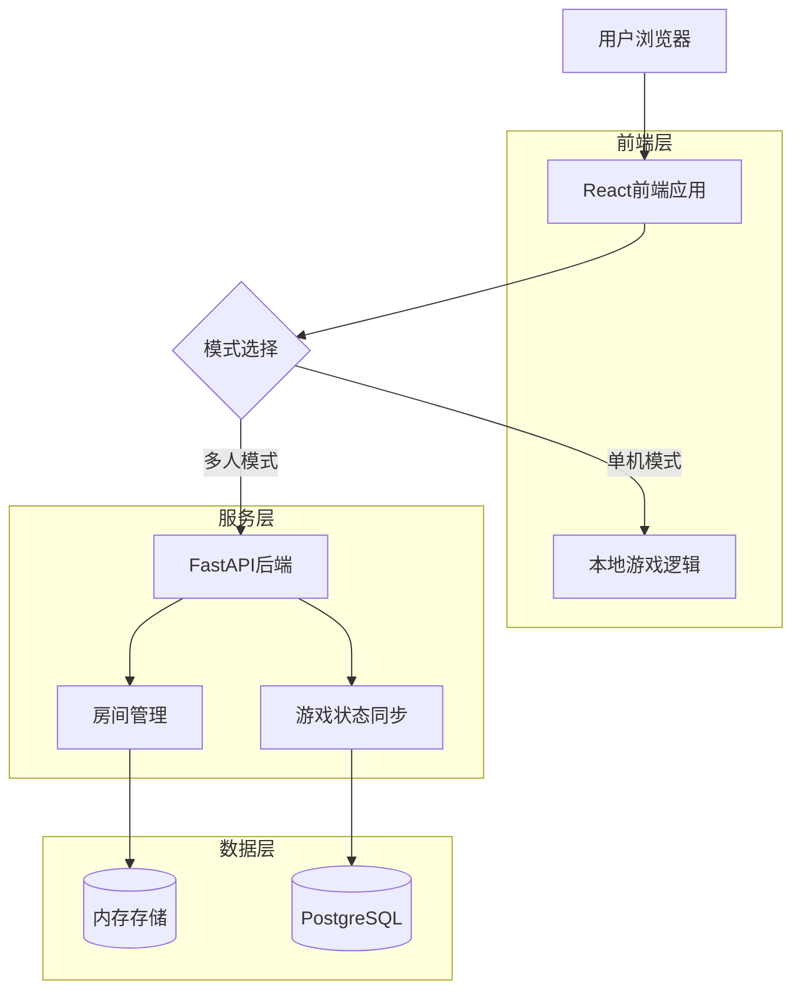
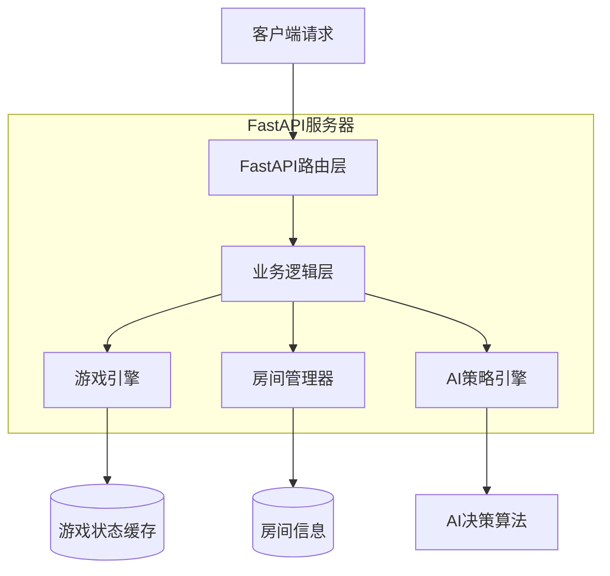
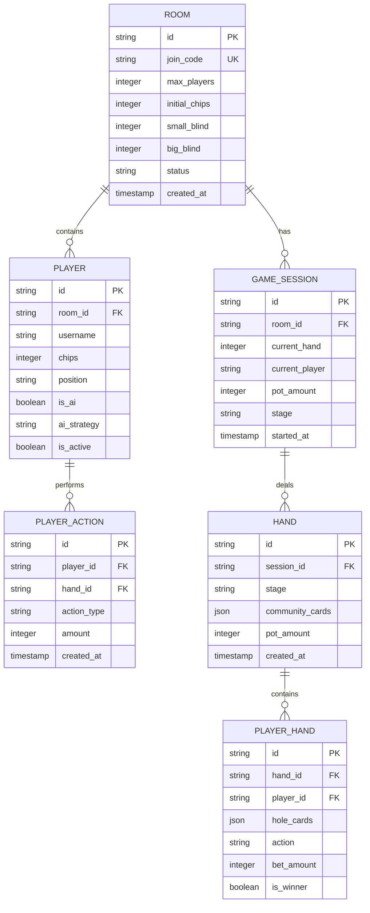

## 1. 架构设计



## 2. 技术描述

- **前端**: React@18 + TypeScript + TailwindCSS@3 + Vite
- **初始化工具**: vite-init
- **后端**: Python FastAPI (仅多人模式)
- **数据库**: PostgreSQL (仅多人模式)
- **状态管理**: React Context + useReducer
- **UI组件**: HeadlessUI + Heroicons

## 3. 路由定义

| 路由 | 用途 |
|------|------|
| / | 首页，模式选择和快速开始 |
| /single-player | 单机游戏页面 |
| /multiplayer | 多人游戏大厅 |
| /room/:id | 游戏房间 |
| /settings | 游戏设置和AI策略配置 |

## 4. API定义

### 4.1 房间管理API

**创建房间**
```
POST /api/rooms/create
```

请求参数：
| 参数名 | 参数类型 | 是否必需 | 描述 |
|--------|----------|----------|------|
| player_count | integer | 是 | 玩家数量 (2-9) |
| initial_chips | integer | 是 | 初始筹码数量 |
| small_blind | integer | 是 | 小盲注金额 |
| big_blind | integer | 是 | 大盲注金额 |

响应：
| 参数名 | 参数类型 | 描述 |
|--------|----------|------|
| room_id | string | 房间唯一标识 |
| join_code | string | 加入房间的验证码 |

**加入房间**
```
POST /api/rooms/join
```

请求参数：
| 参数名 | 参数类型 | 是否必需 | 描述 |
|--------|----------|----------|------|
| room_id | string | 是 | 房间ID |
| username | string | 是 | 玩家用户名 |

### 4.2 游戏状态API

**获取游戏状态**
```
GET /api/game/:room_id/state
```

**执行操作**
```
POST /api/game/:room_id/action
```

请求参数：
| 参数名 | 参数类型 | 是否必需 | 描述 |
|--------|----------|----------|------|
| action | string | 是 | 操作类型 (fold/call/raise/all-in) |
| amount | integer | 否 | 加注金额 |

## 5. 服务器架构



## 6. 数据模型

### 6.1 数据模型定义



### 6.2 数据定义语言

**房间表 (rooms)**
```sql
CREATE TABLE rooms (
    id UUID PRIMARY KEY DEFAULT gen_random_uuid(),
    join_code VARCHAR(6) UNIQUE NOT NULL,
    max_players INTEGER NOT NULL CHECK (max_players >= 2 AND max_players <= 9),
    initial_chips INTEGER NOT NULL DEFAULT 1000,
    small_blind INTEGER NOT NULL DEFAULT 10,
    big_blind INTEGER NOT NULL DEFAULT 20,
    status VARCHAR(20) DEFAULT 'waiting' CHECK (status IN ('waiting', 'playing', 'finished')),
    created_at TIMESTAMP WITH TIME ZONE DEFAULT NOW()
);

CREATE INDEX idx_rooms_join_code ON rooms(join_code);
CREATE INDEX idx_rooms_status ON rooms(status);
```

**玩家表 (players)**
```sql
CREATE TABLE players (
    id UUID PRIMARY KEY DEFAULT gen_random_uuid(),
    room_id UUID REFERENCES rooms(id) ON DELETE CASCADE,
    username VARCHAR(50) NOT NULL,
    chips INTEGER NOT NULL DEFAULT 1000,
    position VARCHAR(10) NOT NULL,
    is_ai BOOLEAN DEFAULT FALSE,
    ai_strategy VARCHAR(20) CHECK (ai_strategy IN ('aggressive', 'conservative', 'calculative')),
    is_active BOOLEAN DEFAULT TRUE,
    joined_at TIMESTAMP WITH TIME ZONE DEFAULT NOW()
);

CREATE INDEX idx_players_room_id ON players(room_id);
CREATE INDEX idx_players_active ON players(is_active);
```

**游戏会话表 (game_sessions)**
```sql
CREATE TABLE game_sessions (
    id UUID PRIMARY KEY DEFAULT gen_random_uuid(),
    room_id UUID REFERENCES rooms(id) ON DELETE CASCADE,
    current_hand INTEGER DEFAULT 0,
    current_player UUID REFERENCES players(id),
    pot_amount INTEGER DEFAULT 0,
    stage VARCHAR(20) DEFAULT 'preflop' CHECK (stage IN ('preflop', 'flop', 'turn', 'river', 'showdown')),
    started_at TIMESTAMP WITH TIME ZONE DEFAULT NOW(),
    updated_at TIMESTAMP WITH TIME ZONE DEFAULT NOW()
);

CREATE INDEX idx_sessions_room_id ON game_sessions(room_id);
CREATE INDEX idx_sessions_stage ON game_sessions(stage);
```