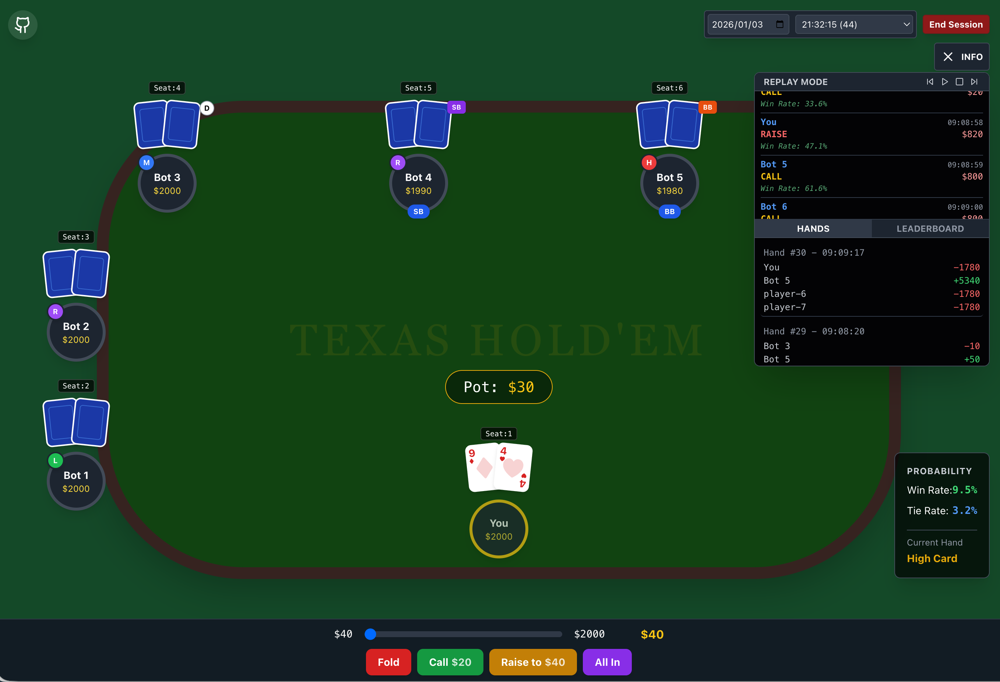

# Play Texas Cards

A modern Texas Hold'em poker game built with React, TypeScript, and Vite.

## Demo

Experience the game here: [https://holdem.broyustudio.com/](https://holdem.broyustudio.com/)

## Features

- **Single Player**: Practice against AI opponents.
- **Multiplayer(Under Development)**: Create rooms and play with friends.
- **Modern UI**: Clean and responsive interface built with Tailwind CSS.
- **Game Logic**: Real-time probability calculation with three level of AI opponents and robust poker rules.

## Tech Stack

- React
- TypeScript
- Vite
- Tailwind CSS
- Zustand (State Management)

## Getting Started

1. Clone the repository
2. Install dependencies: `npm install`
3. Run development server: `npm run dev`
