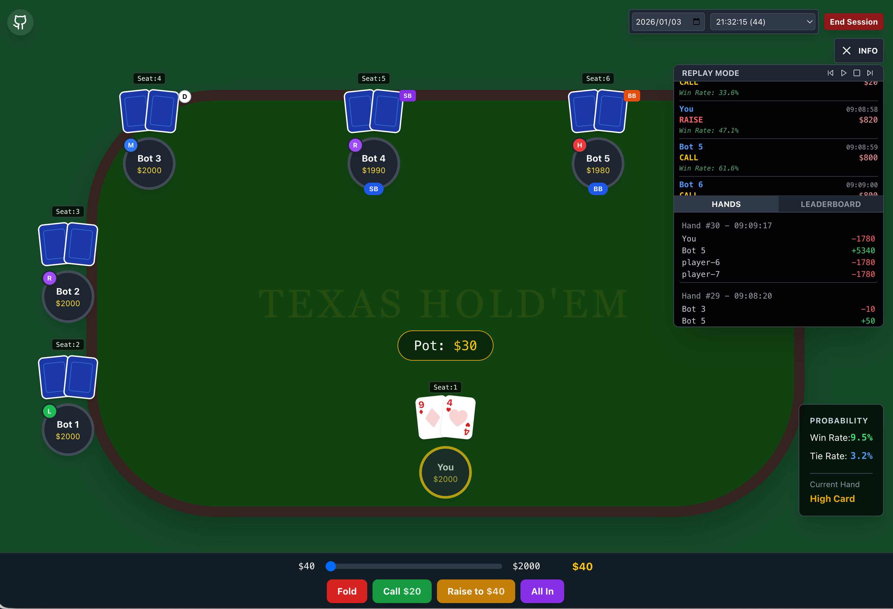

# Play Texas Cards

A modern Texas Hold'em poker game built with React, TypeScript, and Vite.

## Demo

Experience the game here: [https://holdem.broyustudio.com/](https://holdem.broyustudio.com/)

## Features

- **Single Player**: Practice against AI opponents.
- **Multiplayer(Under Development)**: Create rooms and play with friends.
- **Modern UI**: Clean and responsive interface built with Tailwind CSS.
- **Game Logic**: Real-time probability calculation with three level of AI opponents and robust poker rules.
- **Hand Replay**: Review hand history with detailed game state (cards, chips, pot) at every step and reveal all player hole cards.

## Tech Stack

- React
- TypeScript
- Vite
- Tailwind CSS
- Zustand (State Management)

## Getting Started

1. Clone the repository
2. Install dependencies: `npm install`
3. Run development server: `npm run dev`
4. Deployment: `npm run deploy`

## Languages

Use the **中文 / English** buttons to switch between Simplified Chinese and English on any page. Your language preference is saved locally under `texas-holdem-language`; existing game/session storage is unchanged. Switching languages preserves the active hand, form input, open guide, history panel and replay position.

Poker terms, tutorial content, probability labels, hand histories, replay controls, multiplayer forms and validation messages are translated. Multiplayer usernames are kept exactly as entered. Card ranks, suit symbols, standard poker abbreviations, and the table wordmark are unchanged.

Run `npm run test:i18n` for translation/placeholder coverage, preference reload, state-preserving component tests, mocked multiplayer protocol regression, real-engine hand/replay checks and probability-panel translation. These Node-based tests do not open a browser or contact a game server. Existing `npm run check`, `npm run build`, and `npm run lint` scripts remain available.
